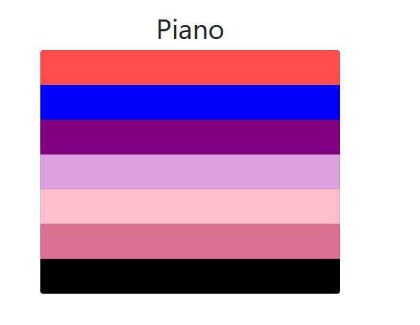

# Piano

This project was created with:

1. Bootstrap 5
2. Angular
3. Flexbox

## Antes de ejecutar usar 
`npm install` 
para generar los archivos de node

This project was generated with [Angular CLI](https://github.com/angular/angular-cli) version 14.2.3.

## Development server

Run `ng serve` for a dev server. Navigate to `http://localhost:4200/`. The application will automatically reload if you change any of the source files.

